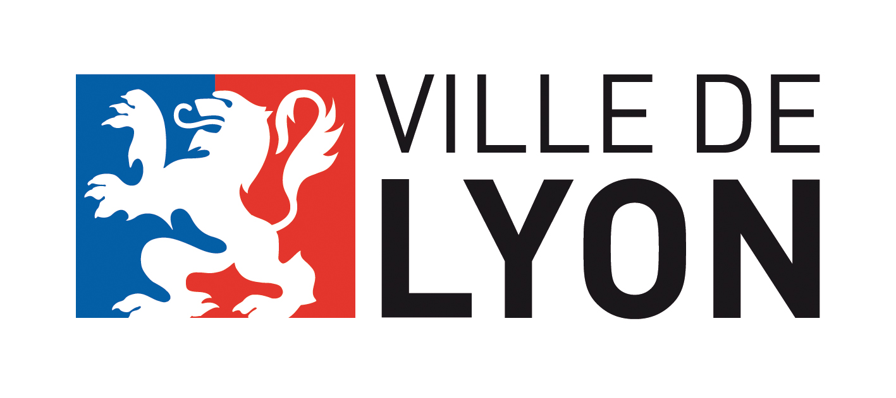
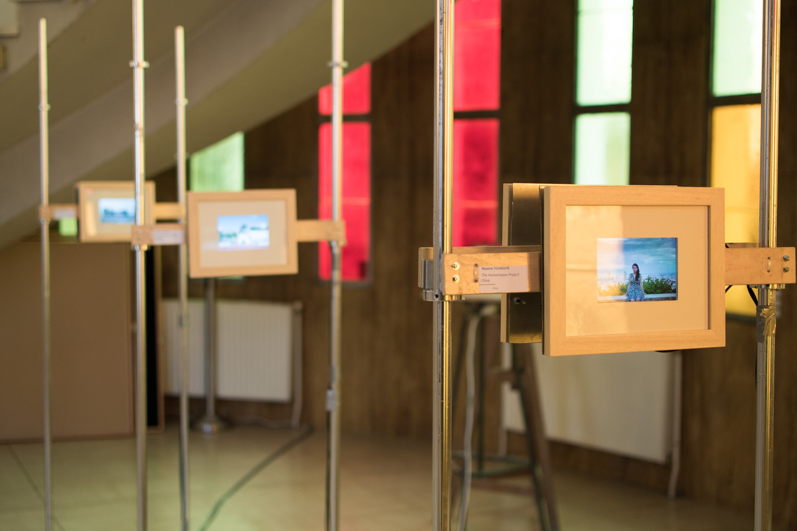
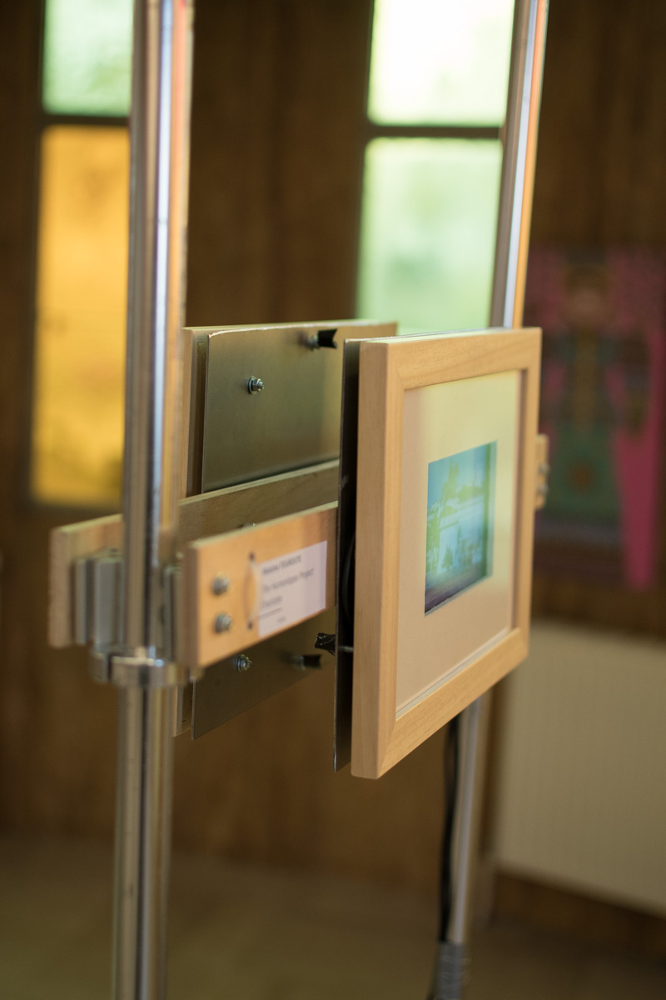
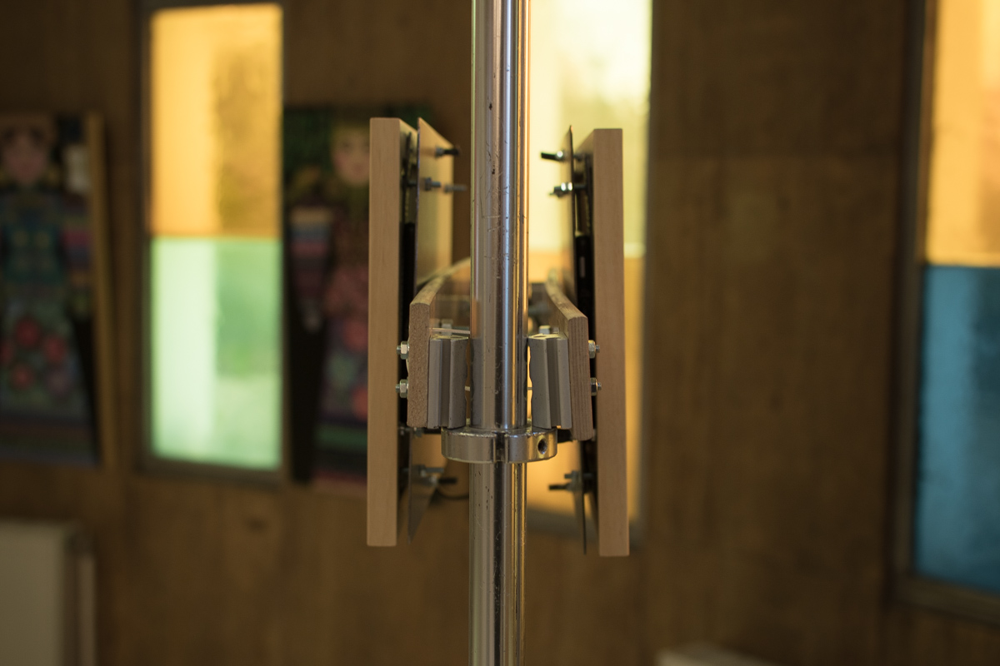
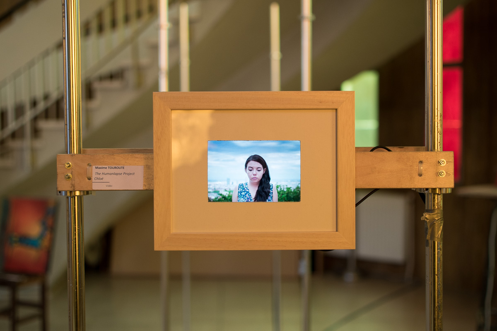
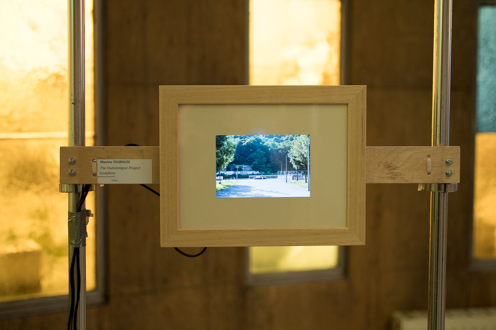
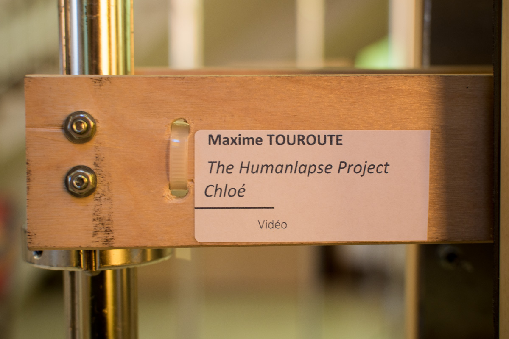

#### Description

The __Humanlapse Project__ is a photography project that aims to explore usage of the timelapse and hyperlapse techniques for human subjects.

<a href="https://instagram.com/maximetouroute/" target="_blank" rel="noreferrer noopener">Check out Humanlapses on Instagram</a>

[Check out humanlapses on website gallery (High quality)](http://maximetouroute.github.io/humanlapse)

 

#### Project Teaser

<iframe src="https://player.vimeo.com/video/292003342" frameborder="0" allowfullscreen width="1920" height="1080"></iframe>

[Direct Link](https://vimeo.com/292003342)

 
 

## Exhibitions

The Humanlapse project has ben selected for exhibition by the Lyon City Hall.

The very first exhibition is happening from the __21st of November until the 17th of December__ at _Mairie de Lyon 9, Lyon, France_

<iframe src="https://player.vimeo.com/video/306033197" frameborder="0" allowfullscreen width="1920" height="1080"></iframe>

[Direct Link](https://vimeo.com/306033197)

 

## Scenography

For this exhibition, I've built digital photo frames each one looping a single humanlapse video. 
The frames are fully autonomous. They turn on in the morning and turn off in the evening without the need of any human intervention. 
The frames are fixed on poles and disposed in an open area so visitors can walk around each humanlapse.

<photo-grid>

</photo-grid>

