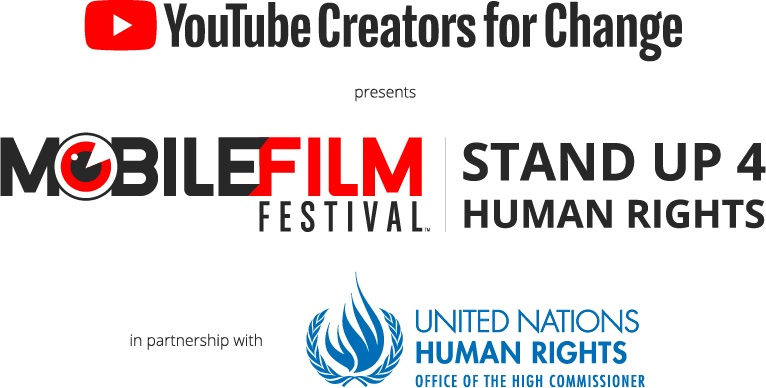

<iframe
  src="https://www.youtube.com/embed/V4CsJzZjhOk?rel=0"
  frameborder="0"
  allowfullscreen
  width="1920"
  height="1080"
></iframe>

[Direct Link](https://www.youtube.com/watch?v=V4CsJzZjhOk)

Court métrage sur la précarité, réalisé pour le [Mobile Film Festival 2018](https://mobilefilmfestival.com/) _#StandUp4HumanRights_.
Réalisé en quelques heures avec un smartphone.
**Selection officielle** parmi 50 films sur un total de 715 films reçus par le festival.
Aussi selectionné pour le [Global Citizen Smartphone Short Film Festival](//www.oncaravan.org/global-citizen)

#### Synopsis

Des mots qui semblent innocents... et pourtant.

#### Règles du festival

Film de 1 minute sur les droits de l'Homme, filmé avec un smartphone.

 
 

