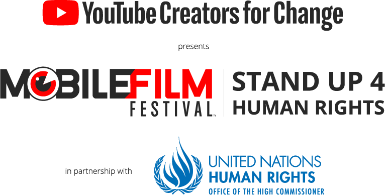

<iframe src="https://www.youtube.com/embed/V4CsJzZjhOk?rel=0" frameborder="0" allowfullscreen width="1920" height="1080"></iframe>

[Direct Link](https://www.youtube.com/watch?v=V4CsJzZjhOk)

#### Description
A short movie about the precarious, made for the [Mobile Film Festival 2018](https://mobilefilmfestival.com/) _#StandUp4HumanRights_.
Shot in a few hours with a smartphone.  
__Official Selection__ among 50 other short movies for a total of 715 received films by the festival.  

#### Synopsis
Words that seem innocent... and yet.

#### Rules of the festival
1 minute short movie about the Human Rights, filmed with a smartphone.

 
 

