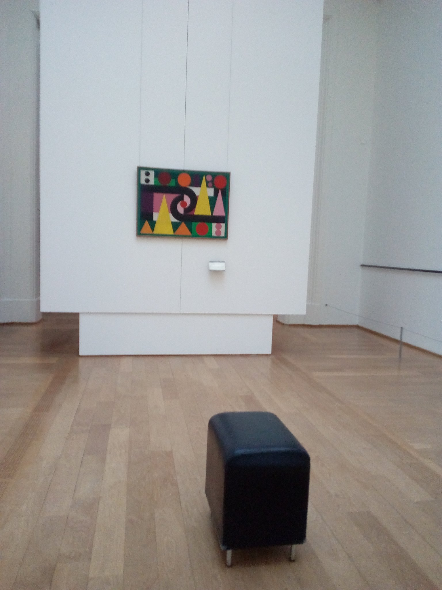
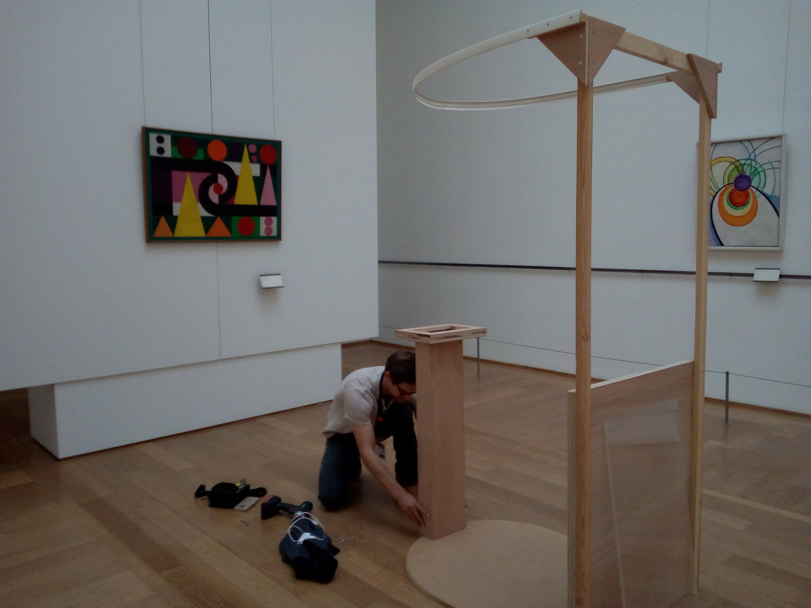
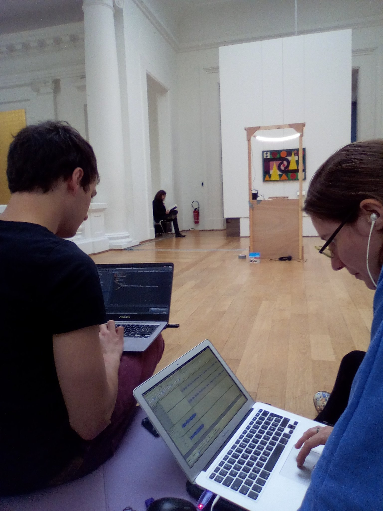
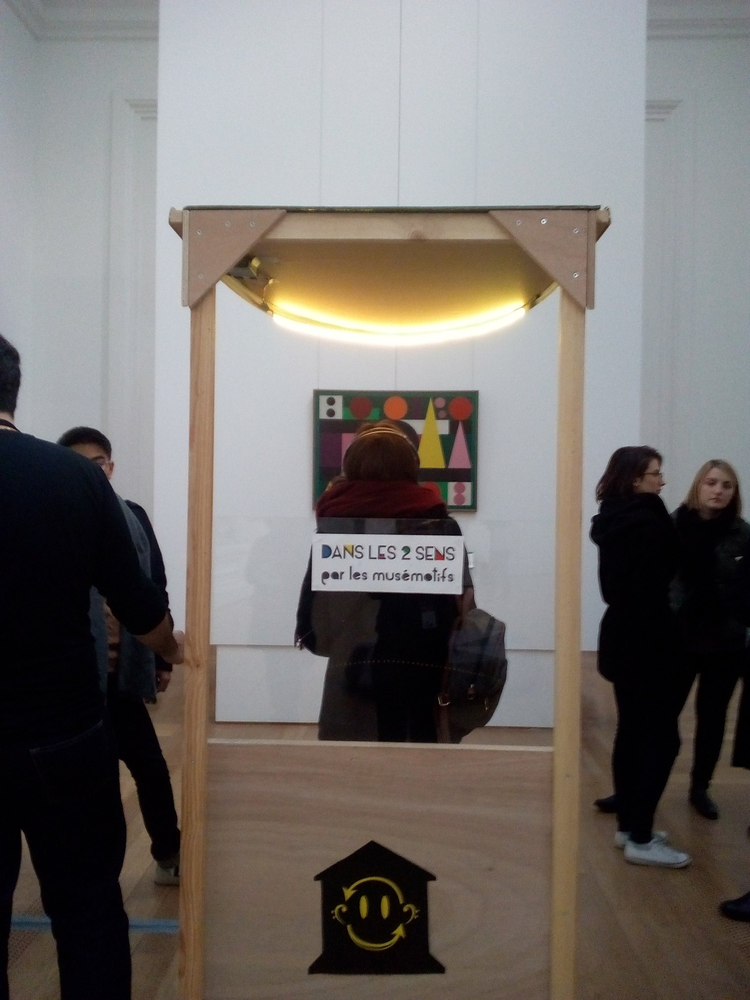
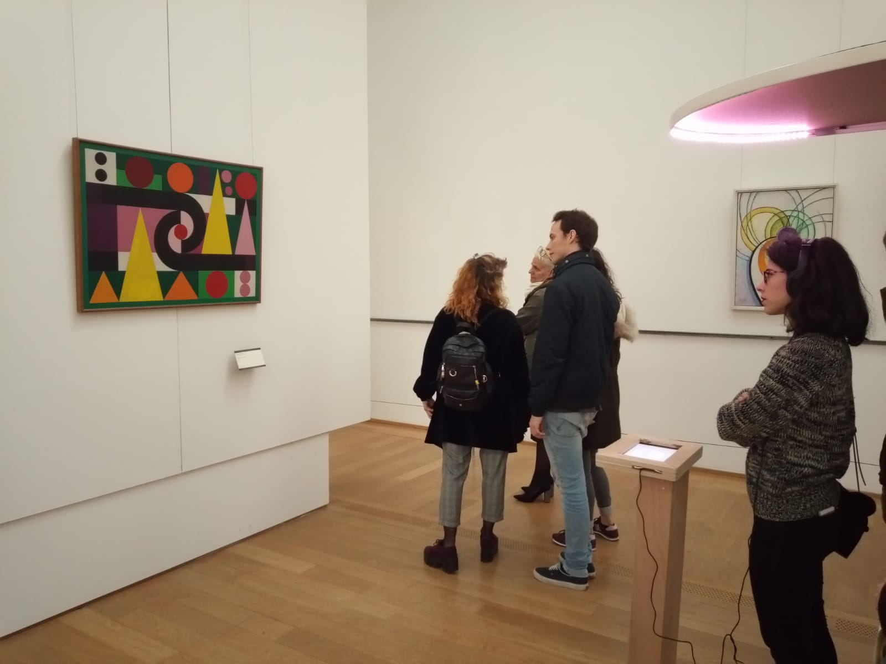
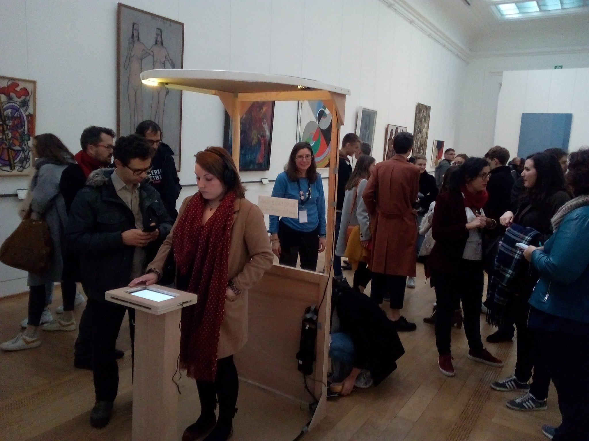
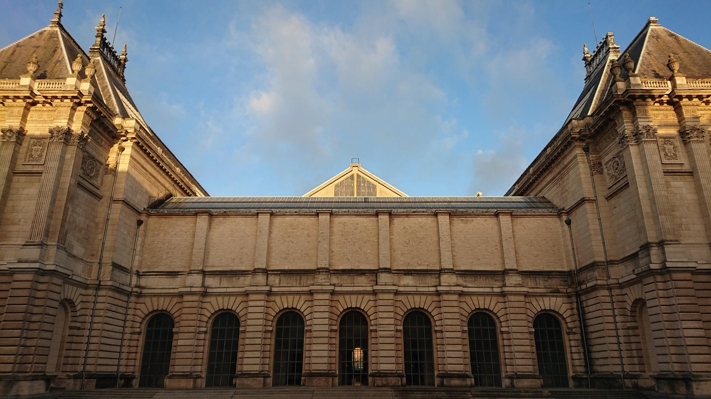
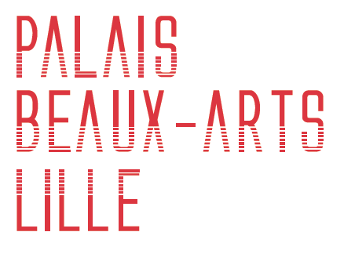
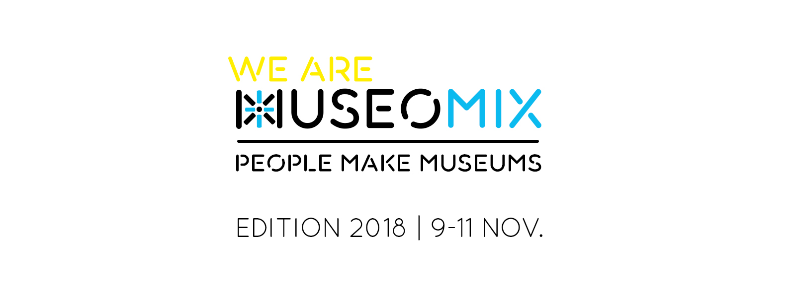

# Description

**Dans les deux sens** is a prototype of museum installation created during the 2018 edition of [Museomix](http://museomix.org/).

It's an emotion pod concept to learn about an art piece by questioning our emotions towards it. 

<photo-grid>

</photo-grid>

# Specs 

* A wood pod with LED Lighting

* An android tablet used as interface

* A Raspberry Pi controlling the pod lighting colours and serving a progressive webapp to the android tablet

This prototype has been built and coded in three days. It is fully autonomous and works with a single plug.
 It was exhibited in November, 2018 at the [Palais des Beaux Arts de Lille](http://www.pba-lille.fr/en).

