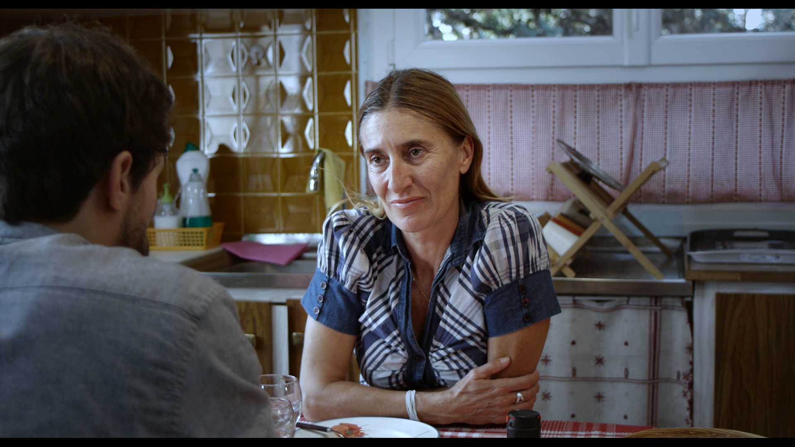
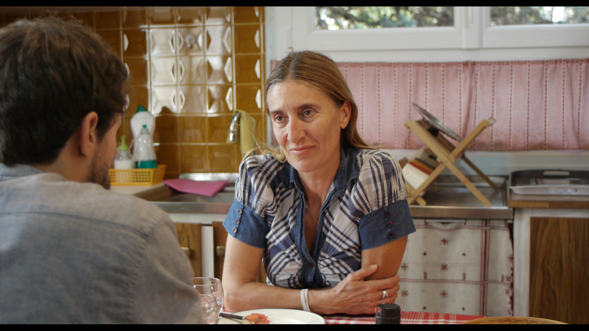

<h1 style="text-align: center">Color Grading works</h1>

Color grading is comparable to the process of developing photos.
It's a meticulous work of bringing images to life to enhance the emotions they carry.
 <strong>Balance</strong> and <strong>accuracy</strong> are as important as <strong>artistic style</strong> because you don't only add a mood to the image, you also guide the audience's gaze to elements in the frame. In today's world where we are surrounded by screens of different sizes and color restitutions, grading is also about making sure every watcher can have the best viewing experience on all types of devices.

 

 
 
 

<image-compare>
    
    
</image-compare>

<image-compare>
    
    
</image-compare>

<image-compare>
    
    
</image-compare>

<image-compare>
    
    
</image-compare>

<image-compare>
    
    
</image-compare>

<image-compare>
    
    
</image-compare>

<image-compare>
    
    
</image-compare>

<image-compare>
    
    
</image-compare>

<image-compare>
    
    
</image-compare>

<image-compare>
    
    
</image-compare>

<image-compare>
    
    
</image-compare>

<image-compare>
    
    
</image-compare>

<image-compare>
    
    
</image-compare>

Stills taken from (in order of appearance):

- _Harmonie des sphères, short movie directed by Vincent Montalieu_
- _La cible, short movie directed by Alex Boulin_
- _Innocent Words, short movie shot with a smartphone_
- _Veronika, short documentary directed by Maxime Touroute_
- _Franchement ça se mange, short movie directed by Bertille Garraud_
- _Ouno, short movie directed by Alex Boulin_
- _Maripega, music clip directed by Maxime Touroute_
- _Indice 50, short movie directec by Vincent Montalieu & Maxime Touroute_
