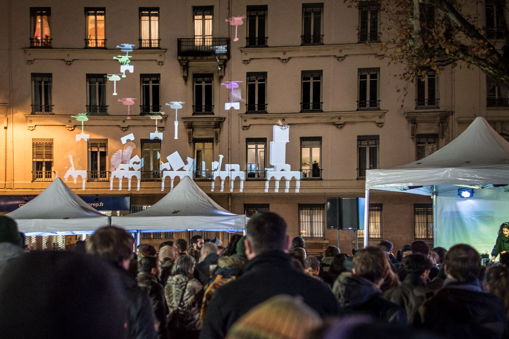

<ImageGrid props={props.data.mdx.frontmatter.embeddedImagesLocal} indices={[0]} />

Jeu multijoueur vidéoprojeté où le public essaie de construire la plus haute tour.

Les joueurs ont un joystick sur leur téléphone pour contrôler un petit hélicoptère sur la façade.
Ils peuvent déposer différents blocs de construction. Les blocs sont fragiles et rebondissent, rendant les tours imprévisibles et très drôles à construire.
Pour faire la tour la plus haute, les joueurs doivent collaborer. Ils peuvent aussi s'affronter et saboter les tours adverses,
qui tombent de façons surprenantes.

Les blocs sont personnalisés pour l'ambiance de l'événement, le lieu et l'architecture du batiment.

## Distribution

Développement du jeu : Tom Guillermin  
Interaction temps-réel : Maxime Touroute  
Développement de l'infrastructure : Guillaume Rahbari / Rémy Dupanloup
