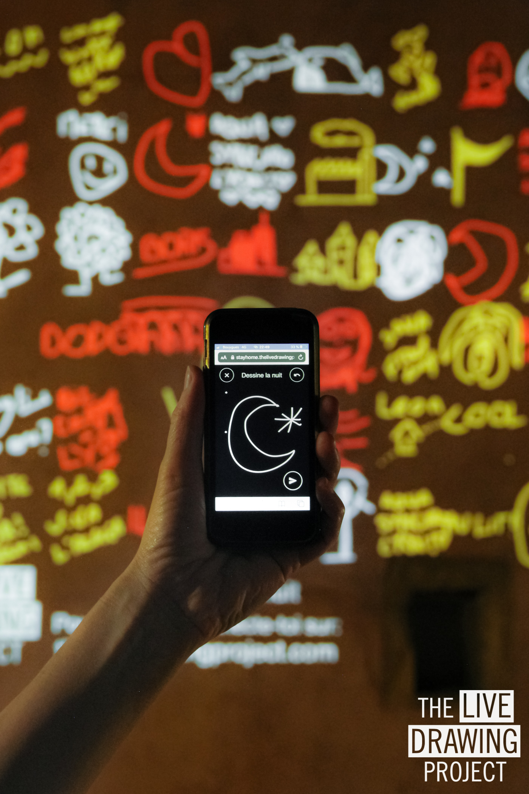
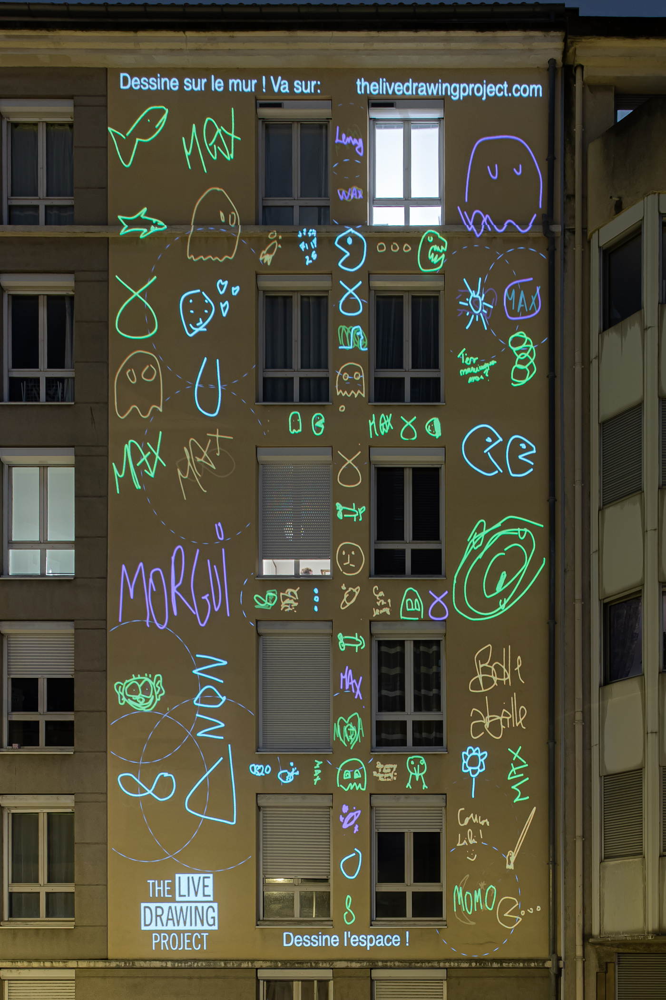
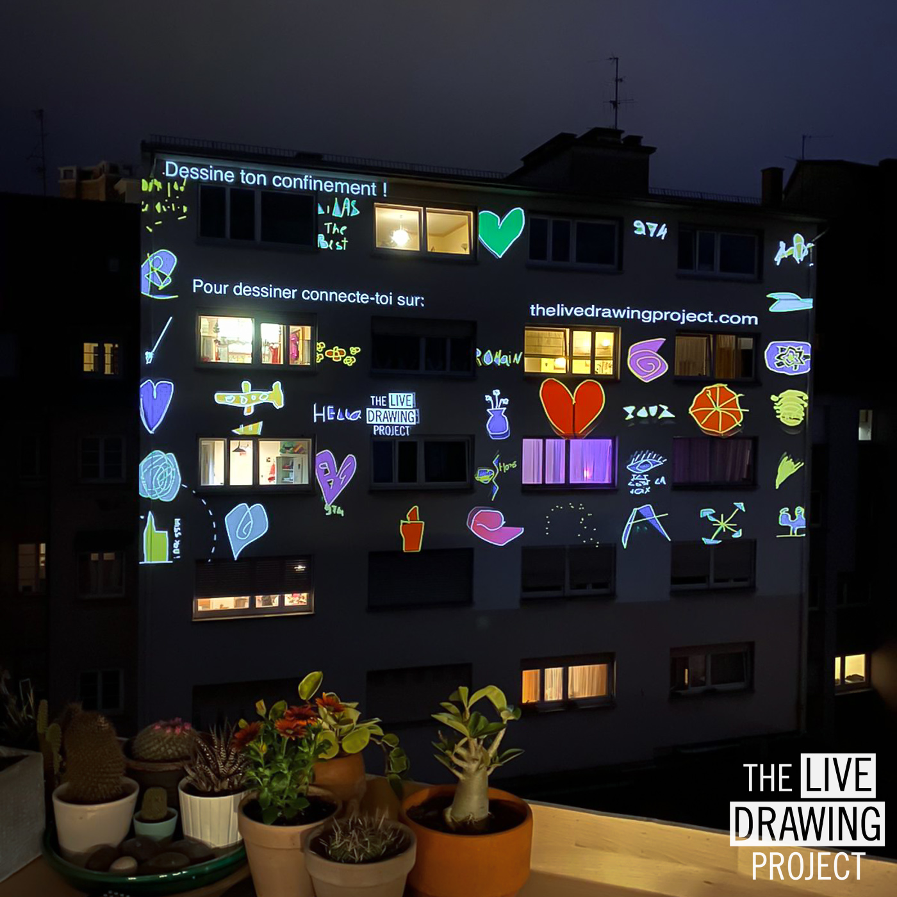

 
 

During lockdown in France I designed a decentralised videoprojection installation to bring art at the doorstep of residential areas. People all over France were able to exhibit [The Live Drawing Project](https://thelivedrawingproject.com) from their window without prior knowledge in videomapping.

Drawings traveled between locations connecting people and creating a **collective artwork evolving with upcoming drawings**. During the French lockdown, more than **9500 drawings** were made by **560 participants** in **30 locations** across **10 cities** simultaneously.

 
 

<photo-grid>

</photo-grid>
