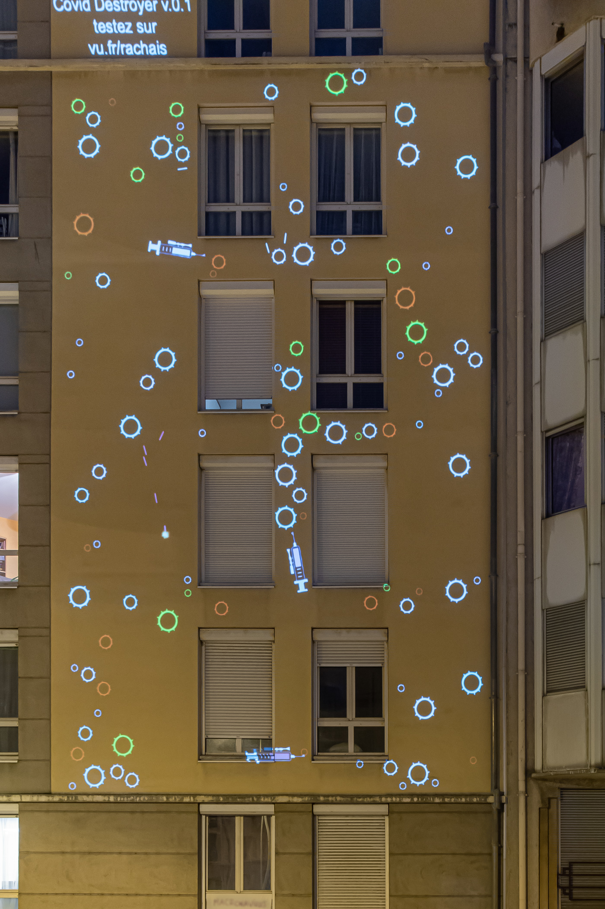
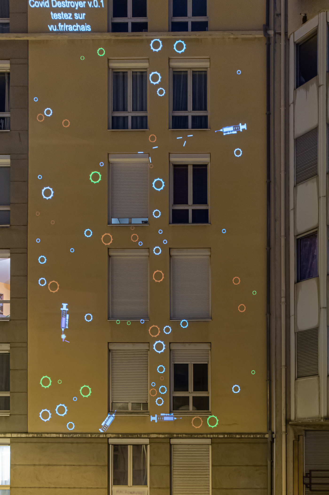

## Description

**Covid Destroyer** is a quirky videoprojected game I've built during the French lockdown to play with my neighbors. From their smartphones each player controls a **needle-machine-gun** inside a plasma full of viruses. The game engine is conscious of the architecture to create fun interactions with facade windows.

Kill them all!

<photo-grid>

</photo-grid>
