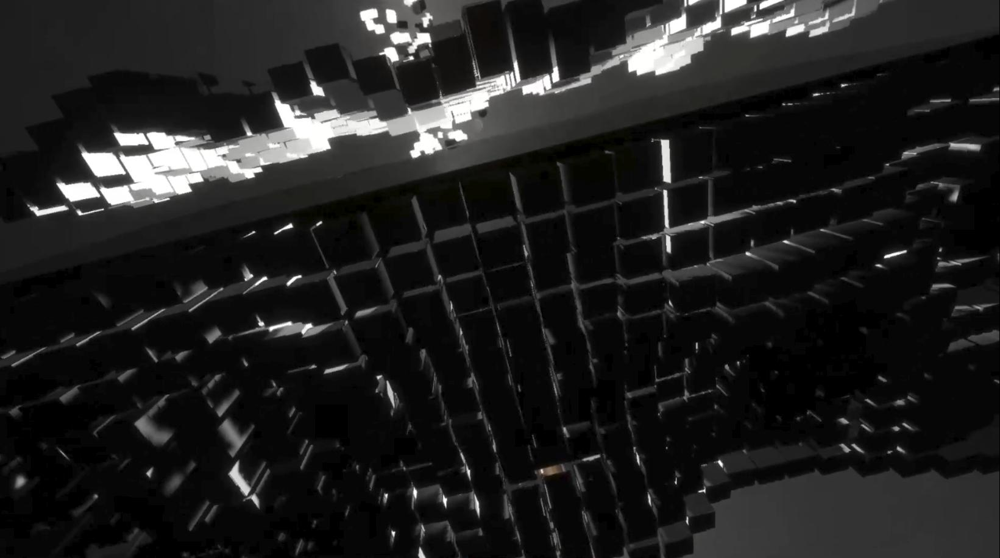

Collaborative live electronic music show in which the crowd gets to choose the next sounds and visuals in real time, exploring a new form of musical improvisation.

_More infos coming soon_

## Distribution

3D, Music : Tom Guillermin  
Realtime interaction : Maxime Touroute  
Infrastructure Development : Guillaume Rahbari / Rémy Dupanloup
