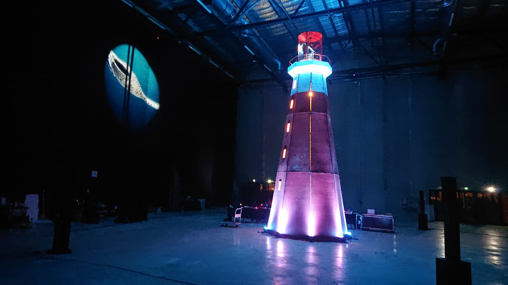

<ImageGrid props={props} indices={[1, 2, 3]} />

Installation interactive avec un système de vidéoprojection à 360°. Les enfants sont invités à utiliser une roue de bateau pour controler le faisceau de la projection.

_Le Phare est une installation interactive qui met l’océan dans la ville et donne les commandes à nos enfants. A l’entrée d’une place publique, un phare lumineux est dressé comme un appel à scruter l’horizon qui s’offre à nous. Il projette des portraits sur les façades alentours, autant de figures intimes pour évoquer de brumes en tempêtes les liens sacrés entre l’Homme et la Nature. Alors que sur les façades : l’eau monte !_

## Role

Développement et interaction temps-réel.  
Conception d'une écriture hybride qui s'adapte aux mouvements de la roue de bateau.

## Distribution

Direction artistique : Pierre Amoudruz  
Composition musicale & spatialisation : David Guerra, Victor Roux  
Création vidéo, 3D & temps réel : Pierre Amoudruz, Victor Roux, Maxime Touroute  
Création lumière : en cours  
Commédien-nes voix off : Jana Klein  
Design d'interaction : Pierre Amoudruz, David Guerra, Thomas Pachoud  
Électronique, ingéniérie & motorisation : Thomas Pachoud  
Scénographie & construction : Vincent Loubert [Louxor Spectacle](https://www.louxorspectacle.com/)  
Direction technique : Alexandre George  
Chargée de production : Cyrielle Tissandier  
Coproductions : Lieux publics, Centre National des Arts de la Rue et dans l’espace public & Pôle européen de production , Marseille Les Ateliers Frappaz, Centre National des Arts de la Rue et dans l’espace public Villeurbanne, Les Abattoirs, Centre National des Arts de la Rue et dans l’espace public & le Festival Chalon dans la rue Bipolar Production - Le Plan Rhône., Montpellier  
PRODUCTION : [AADN - Arts et Cultures Numériques](https://aadn.org/)  
Subventionnée par : SACD / Auteurs d’espaces / Région et DRAC Auvergne Rhône-Alpes / Fonds [SCAN](https://www.auvergnerhonealpes.fr/aide/2/89-fonds-de-soutien-a-la-creation-artistique-numerique-fonds-scan-culture-patrimoine.htm)
