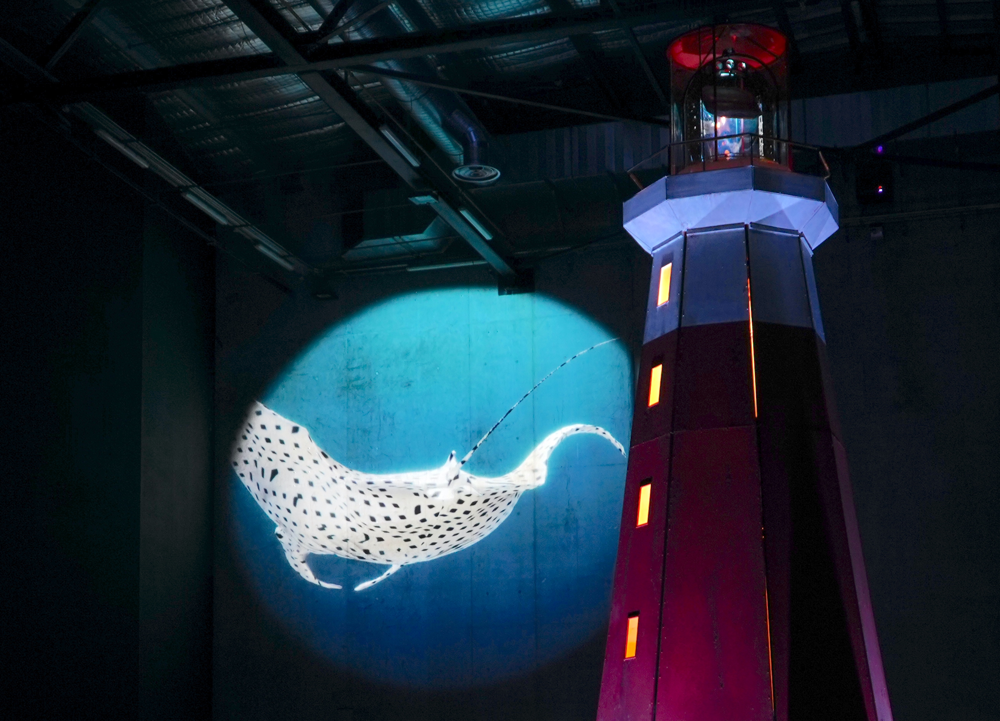

<ImageGrid props={props.data.mdx.frontmatter.embeddedImagesLocal} />{' '}

Interactive installation with a 360° video projection system. Children are invited to use a boat wheel to control the projection.

_Le Phare (The Lighthouse) invites us to look at the horizon beyond city walls. It projects intimate figures talking about the sacred and forgotten links between humans and nature. Meanwhile, on the walls, sea level is rising..._

## Role

Development and real time interaction.  
Conception of hybrid writing principles adapting to boat wheel movements.

## Distribution

Art direction : Pierre Amoudruz  
Music & Spatialisation : David Guerra, Victor Roux  
Video, 3D, Real time : Pierre Amoudruz, Victor Roux, Maxime Touroute  
Lighting : in progress
Voiceover talent : Jana Klein  
Interaction design : Pierre Amoudruz, David Guerra, Thomas Pachoud  
Engineering : Thomas Pachoud  
Set design and building : Vincent Loubert [Louxor Spectacle](https://www.louxorspectacle.com/)  
Technical Direction : Alexandre George  
Production delegate : Cyrielle Tissandier  
Co-Productions : Lieux publics, Centre National des Arts de la Rue et dans l’espace public & Pôle européen de production , Marseille Les Ateliers Frappaz, Centre National des Arts de la Rue et dans l’espace public Villeurbanne, Les Abattoirs, Centre National des Arts de la Rue et dans l’espace public & le Festival Chalon dans la rue Bipolar Production - Le Plan Rhône., Montpellier  
Production : [AADN - Arts et Cultures Numériques](https://aadn.org/)  
Grants by : SACD / Auteurs d’espaces / Région et DRAC Auvergne Rhône-Alpes / Fonds [SCAN](https://www.auvergnerhonealpes.fr/aide/2/89-fonds-de-soutien-a-la-creation-artistique-numerique-fonds-scan-culture-patrimoine.htm)

Photo Credits: Clement MERLE, Pierre AMOUDRUZ
