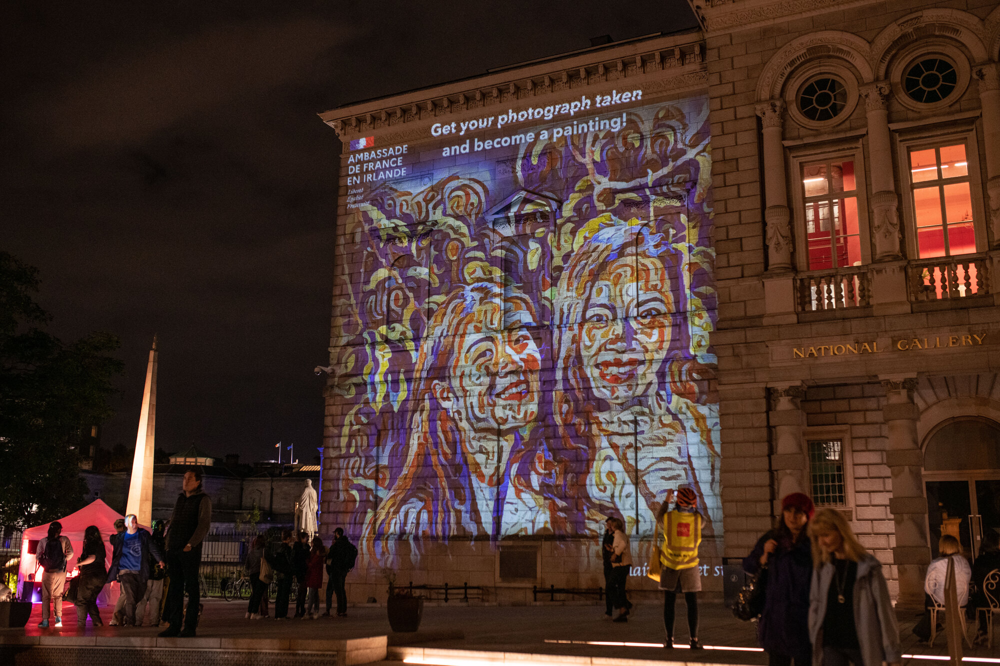

 

__Painting Mirror__ est un videomapping interactif où le public est pris en photo puis apparait videoprojeté dans le style de grands artistes (peinture, dessin). 
Le public a le temps de photographier sa projection et peut récupérer sa photo stylisée en copie numérique ou imprimée.
Les styles sont générés par une Intelligence Artificielle.
L'installation s'adapte à chaque représentation pour utiliser le style d'artistes en lien avec l'événement ou la collection exposée.

<ImageGrid props={props.data.mdx.frontmatter.embeddedImagesLocal} />{' '}

Présenté à Culture Night 2022, en partenariat avec l'ambassade de France en Irlande et la National Gallery d'Irlande.

Photos: Courtesy of French Embassy in Ireland – [Dora Kazmierak](https://www.dorakazmierak.com/)

## Réalisation

Tom VENIAT, Maxime TOUROUTE, Rémy DUPANLOUP

## Réservation

[maxime.touroute@gmail.com](mailto:maxime.touroute@gmail.com)
