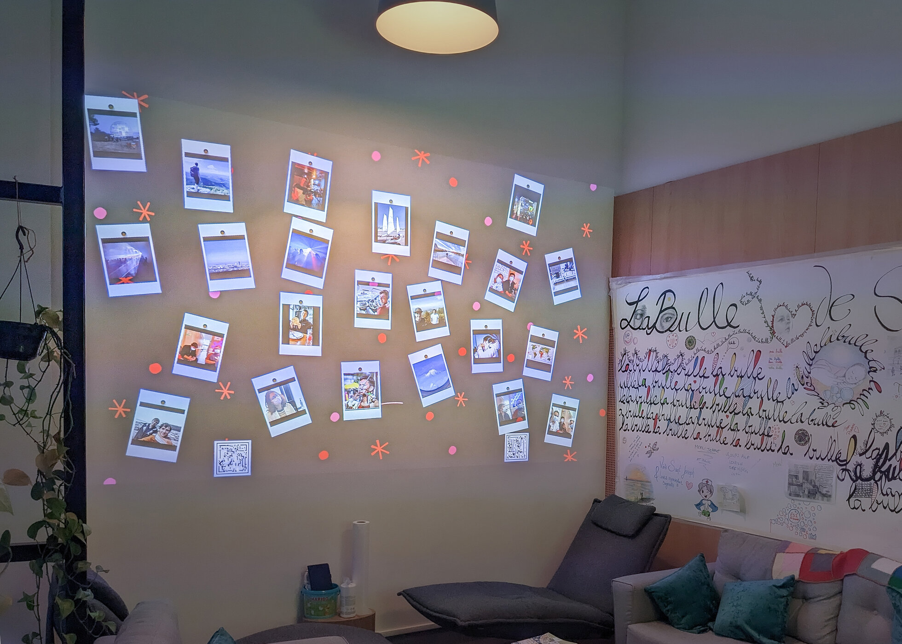

  

La bulle est un projet de mur photo interactif développé dans le but de créer du lien dans les lieux de vie. Il s'inspire des panneaux de liège avec des cartes postales que l'on retrouve souvent.
Les participants peuvent envoyer des photos et messages depuis leur téléphone portable à n'importe quel moment et depuis n'importe où. Les contenus apparaissent ensuite vidéoprojetés dans un ou plusieurs lieux, permettant de créer du lien au sein des équipes, mais aussi entre différents sites. Le projet a été inauguré en présence de la première dame Brigitte Macron.

  

<ImageGrid props={props.data.mdx.frontmatter.embeddedImagesLocal} />{' '}
  

### Cette technologie vous intéresse ? [Contactez-moi](mailto:maxime.touroute@gmail.com)

  
## Production

Développement informatique :  Maxime Touroute, Rémy Dupanloup  
Scénographie Hopital Saint Joseph : Louis Clément
