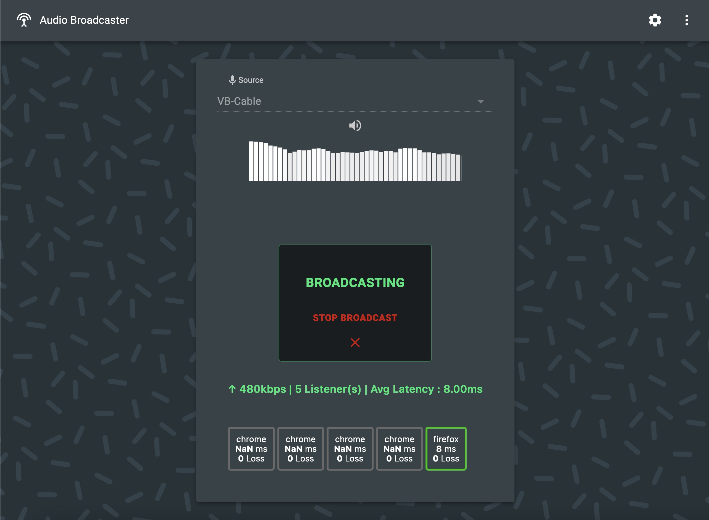

 
 

_Audio Broadcaster_ est un __logiciel mutualisé__ avec les lieux culturels, musiciens, artistes numériques, et plus généralement la communauté créative. 
Il permet de diffuser du son en direct vers des smartphones de manière très légère, sans matériel spécifique et sans application à installer. Le logiciel est mis à jour et amélioré __selon vos besoins__ pour débloquer un maximum de cas d'usages.

### Accès sur demande à [maxime.touroute@gmail.com](mailto:maxime.touroute@gmail.com)
  

## Caractéristiques 

- Audio stéréo HD
- Latence ultra-faible  {'<'}100ms en 4G,  {'<'}10ms en Wi-Fi
- Fonctionnel en 4G (pour le public et l'émetteur)
- Jauge : 100+ participants
- Pas besoin de matériel spécifique (ordinateur, smartphones)
- Portée : infinie (terre entière, tant qu'il y a un accès internet)

## Comment ça marche ?

Utilisez un téléphone ou un ordinateur pour diffuser du son. Le son peut provenir d'un micro ou bien d'un logiciel (Media Player, Ableton Live, ...). Le son transite par le réseau internet (4G ou Wi-Fi). 
Le public ouvre une page web (ou scanne un QRCode) et reçoit le signal audio live immédiatement. Il n'y a pas besoin d'installer d'application.

## Cas d'usages

* Audiodescription live
* Visites guidées
* Parcours sonores
* Concerts silencieux
* Diffusions sonores à distance
* Art sonore, créations originales
* Une autre idée ? [Dites le nous !](mailto:maxime.touroute@gmail.com)

 
 

<ImageGrid props={props.data.mdx.frontmatter.embeddedImagesLocal} />{' '}
  

### Accès sur demande à [maxime.touroute@gmail.com](mailto:maxime.touroute@gmail.com)
