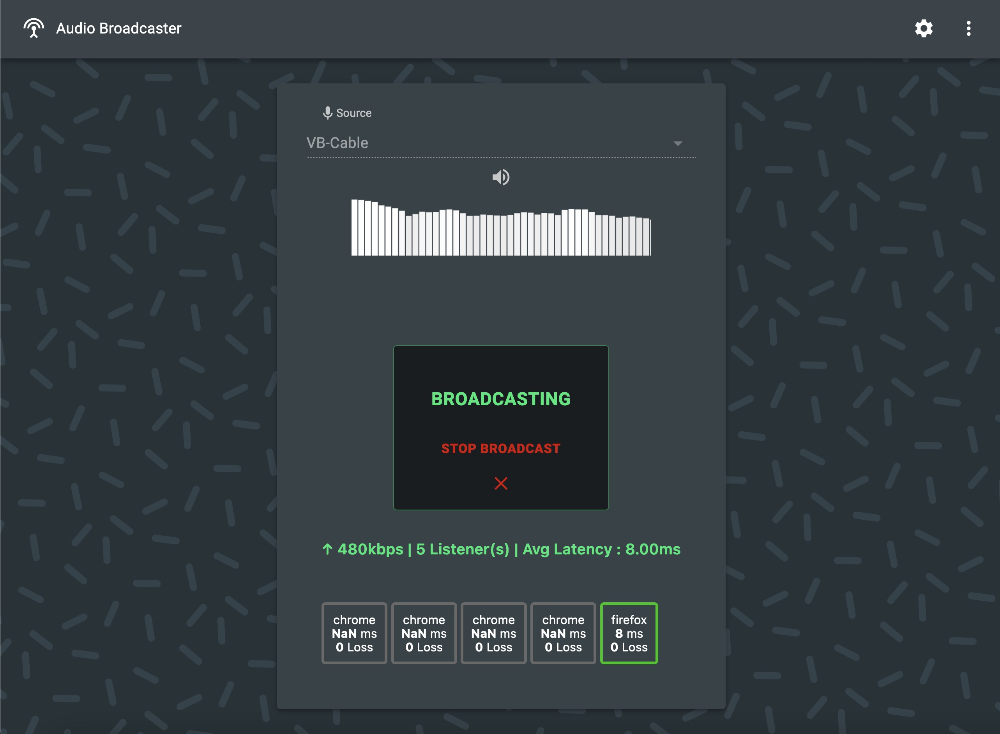

  

 
 

_Audio Broadcaster_ is a __shared software__ with cultural institutions, musicians, artists and the entire creative community. 
The software allows simple real-time audio transmission to smartphones without the need for specific hardware or an app to install. The software is updated and improved __for your needs__ to unlock as many use cases as possible.

### Ask for access at [maxime.touroute@gmail.com](mailto:maxime.touroute@gmail.com)
  

## Main features 
- HD Audio
- Ultra-low latency  {'<'}100ms for cellular network,  {'<'}10ms for Wi-Fi
- Works in 4G (for the listeners and the broadcaster)
- Up to 100+ users
- No specific equipment required (laptop, smartphones)
- Range : entire planet (as long as you have internet)

## How does it work?

Use a phone or a computer to broadcast audio.
The audio can come from a microphone or any other sound software (media player, Ableton Live, ...). 
Audio is transmitted through internet (LTE 4G, Wi-Fi).
The audience opens a web page (or scans a QRCode) on their phone and receive the audio immediately. 
There is no app to download.

## Use cases

* Audiodescription live
* Guided tours
* Audio tours
* Silent concerts
* Remote audio listening
* Sound art, creations
* Another idea? [Tell us!](mailto:maxime.touroute@gmail.com)

 
 

<ImageGrid props={props.data.mdx.frontmatter.embeddedImagesLocal} />{' '}
  

### Ask for access at [maxime.touroute@gmail.com](mailto:maxime.touroute@gmail.com)