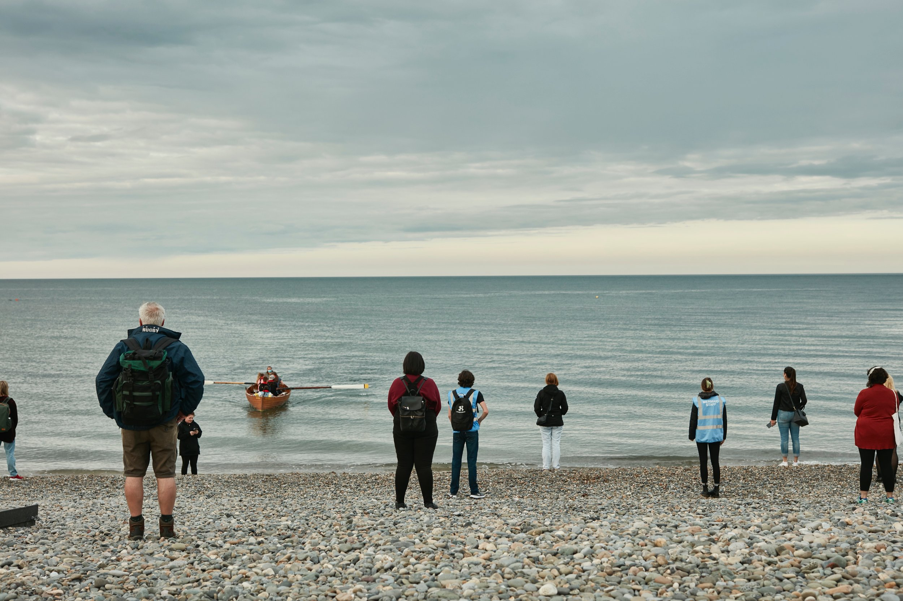
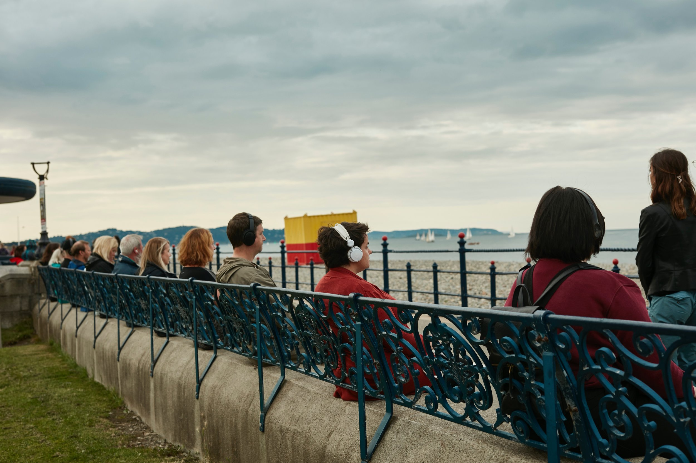

  

<ResponsiveIframe
  src="https://www.youtube.com/embed/Ot1SFGE-gRI?si=5KCK0fs2cQ-XgAP"
  width="1920"
  height="1080"
/>

[Direct Link](https://www.youtube.com/watch?v=Ot1SFGE-gRI)

Part flash mob, part silent disco, part Mass—OF A MIND is a guided walking tour set in your community. 

Guided by a narrator and set to a score of local voices, stories, sounds, and music, audiences of up to 50 at a time are brought on a journey through often-missed parts of their environment in an exploration of mindfulness, urban ecology and social interactions.  

Audiences are kept in sync with each other through their own smartphone and headphones.

Meditative, immersive, and informed by the latest in mind-body research, audiences dive deeply into the mystery of our minds as we step into rhythm with our breath and take a trip through the collective consciousness.

### Role
Provision of the shared software [Audio Broadcaster](/audio-broadcaster) allowing real-time HD audio transmission to audience smartphones.

### Cast & Crew
Created by [Listen and Breathe](https://www.listenandbreathe.live/)  
  
In collaboration with Hui Cha Poos, Kelly Kerwin, Kevin McNamara, Emily Reilly, and Emily Zemba.  

Original Music: Kevin McNamara  

Videos by Alan Fisher, Dan Fowler, and Caleb Germany  

Photos: Rosie Barrett, Brid O’Donovan   