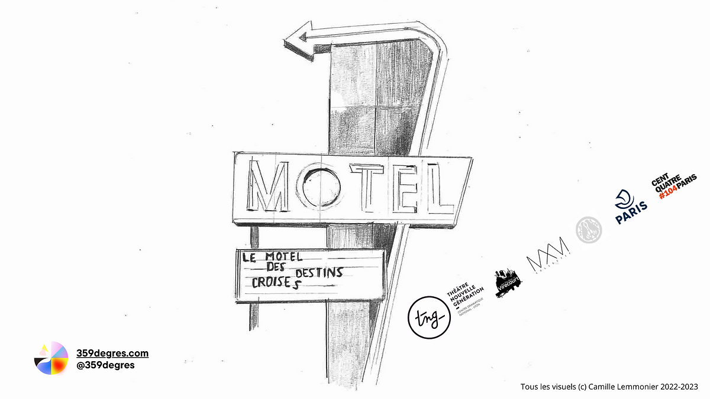

 
 

Dive into the subconscious of Didier, an insomniac who struggles to sleep and therefore, to dream.  

Immersive theater performance for 150 spectators, suitable for all audiences. A hybrid experience blending live art with the insides of a dream. A Technological tool allows spectators to interact with the unfolding narrative.

### Role

* Software design
* Provision of the shared software [live-maker](/live-maker) enabling massive audience interaction

### Cast & Crew
Direction: Eva Carmen Jarriau  
Software design: Maxime Touroute  
Scenography: Camille Lemmonier  
Dramaturgy: Gaia Singer  
Performers: Laurène Thomas, Tristan Conttin  
Sound Design: Fabio Meschini  
Production Administrator: Ludivine Rhein  
Lighting Design: Francois Luberne  
Costume Design: Nathalie Désandré  
[Compagnie 359 Degrés](https://www.359degres.com/)  

### Projet in creation
[Invite the team for an art residency](mailto:contact@359degres.com)

 
 
  
_Photo Credits : Axel Fried  
Illustration : Camille Lemmonier_