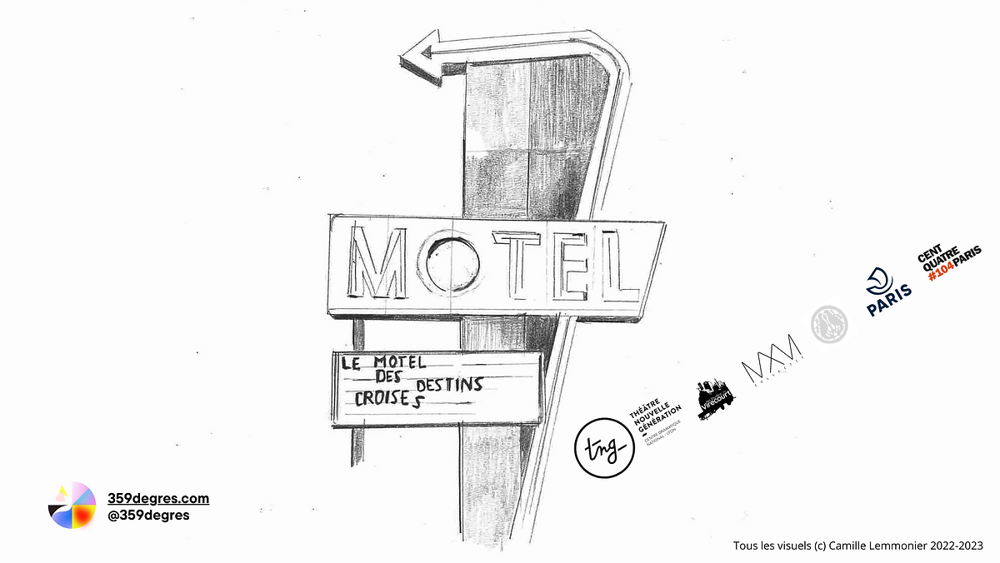

 
 

Plongez dans l’inconscient de Didier, insomniaque, qui peine à dormir et donc, à rêver.  

Spectacle de théâtre immersif pour environ 150 spectateur·ice·s, tout public à partir de 12 ans. Une expérience hybride mêlant art vivant et un outil technologique 
permettant aux spectateurs d’agir dans le récit qui se déroule sous leurs yeux comme à l’intérieur d’un rêve.

### Role : Création logicielle

### Logiciel mutualisé : [live-maker](/live-maker)

### Distribution
Mise en Scène : Eva Carmen Jarriau  
Conteption Numérique : Maxime Touroute  
Scénographie : CAMILLE LEMONNIER  
Dramaturgie : Gaia Singer  
Interpretes : Laurène Thomas, Tristan Conttin  
Création sonore : Fabio Meschini  
Administratrice de production : Ludivine Rhein  
Création Lumière : Francois Luberne  
Costumes : Nathalie Désandré  
[Compagnie 359 Degrés](https://www.359degres.com/)

### Projet en création
[Inviter l'équipe en résidence](mailto:contact@359degres.com)

 
 
  
_Credits Photo : Axel Fried  
Illustration : Camille Lemmonier_