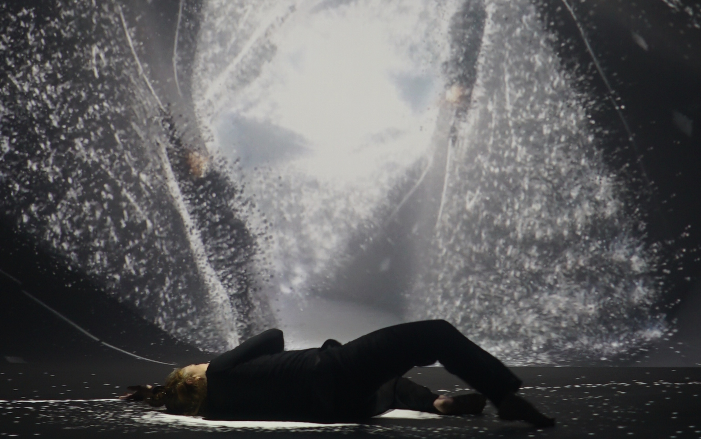

<ImageGrid props={props.data.mdx.frontmatter.embeddedImagesLocal} />{' '}

Et si la latence n’était pas simplement un problème informatique ? Si derrière ce léger retard se cachait un espace temporel où tout peut se passer ?  

Spectacle dansé avec captation live et videoprojection où le monde réel et le monde numérique entrent en collision.  

### Projet en création
[Inviter l'équipe en résidence](mailto:natacha@c-a-b.fr)

### Distribution
__Co-auteurs__  
Natacha Paquignon, chorégraphe  
Quentin Bozon, artiste numérique, designer interactif  

__Chorégraphe__  
Natacha Paquignon

__Danseuses__  
Laure-Anne Deltort  
Natacha Paquignon  

__Création musicale__  
Simon Jurine  

__Développement informatique__  
Maxime Touroute

 
 
  
_Credits Photo : Quentin Bozon_