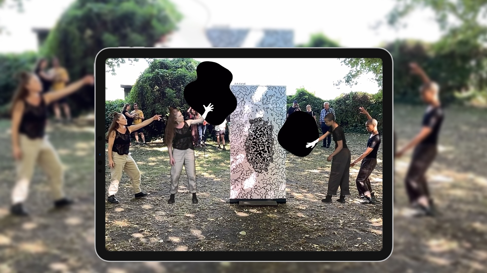

# A Dance Performance in Mixed Reality

 

<ResponsiveIframe
  src="https://player.vimeo.com/video/1007424558"
  width="1920"
  height="1080"
/>

 
 

## How does it work?

Two dancers appear in Augmented Reality (AR) through a screen. Invisible to the naked eye, they challenge our perception of reality and space.

The dancers emerge from an image—a metaphorical doorway to their inner world. This image, placed in the real space, acts as a marker to trigger the augmented reality experience.

The performance is presented in two complementary forms.

### Form 1 : XR Performance

Four dancers, 2 virtual and 2 physical, perform together.  
* **Type**: Indoor or outdoor performance  
* **Interaction**: The audience views the AR experience through iPads on stands  
* **Scale**: life-sized
* **Duration**: 5 minutes, up to 6 repetitions  

<ImageGrid props={props.data.mdx.frontmatter.embeddedImagesLocal.slice(0, 3)} />{' '}

### Form 2 : AR Installation / Exposition

* **Interaction**: Viewable via an iPad with the AR layer or using visitors' own smartphones  
* **Scale**: Adaptable to the location, ranging from miniature to life-sized  
* **Duration**: 4-minute infinite loop  

<ImageGrid props={props.data.mdx.frontmatter.embeddedImagesLocal.slice(3, 9)} />{' '}

<ResponsiveIframe
  src="https://player.vimeo.com/video/1014448831"
  width="1080"
  height="1080"
/>

 
 

## Powered by Revy 

For this project, we developed new features:  
* **Performance Plug-in**: Synchronizes and monitors AR devices with live audio  
* **Exhibition Plug-in**: Enables day-long AR visualization with monitoring tools  

## Author Note

_Our work explores liminal spaces—the connections between the body, space, and technology, as well as the interplay of visible and invisible realms. Can a digital world heighten awareness of our physical human presence?_ — Natacha Paquignon

## Distribution

* **Co-author, Choreographer**: [Natacha Paquignon](//natachapaquignon.com)  
* **Co-author, Visual Artist, Developer**: [Maxime Touroute](//maximetouroute.com)  
* **Dancers**: [Natacha Paquignon](//natachapaquignon.com) & [Kynsie Serre](//www.instagram.com/__kynsie/)  
* **Filmmaker**: [Selim Tigrine](//fr.linkedin.com/in/selim-tigrine-b38408170)  
* **Music**: _Battements_ by [Odalie](//odalie.bandcamp.com)  

Supported by [Enter Art Fair](//www.enterartfair.com)  
Sponsored by the [Danish Arts Foundation](https://www.kunst.dk/english/about-us), the [Beckett Foundation](https://www.kb.dk/en/beckett-foundation), and the [French Institute of Denmark](https://institutfrancais.dk/fr).

# Booking 

Simon / Cie Natacha Paquignon  
[production@c-a-b.fr](mailto:production@c-a-b.fr)
