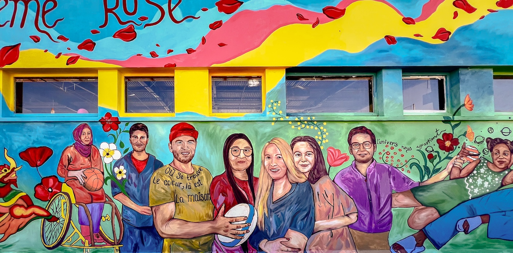
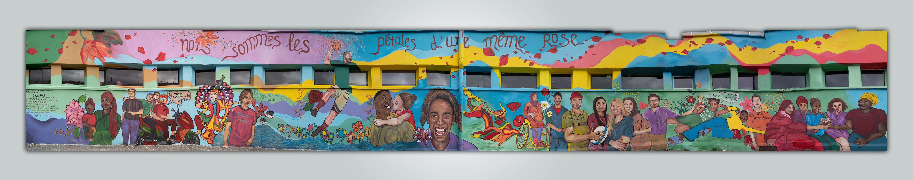

## Une fresque participative de 200 m² mêlant peinture et numérique 

  
<ImageGrid props={props.data.mdx.frontmatter.embeddedImagesLocal.slice(0,3)} />{' '}
  

# En deux mots

Une fresque monumentale de 200 m² dans le quartier populaire du Zodiaque à [Annonay](https://www.annonay.fr/), co-créée avec les habitants.

* __Ateliers participatifs et chantier d’insertion sociale et professionnelle :__ 10+ jeunes employés pour une démarche d'insertion
* __Création dirigée par les habitants :__ choix des contenus et couleurs ; création des contenus en Réalité Augmentée
* __Réalité Augmentée :__ en filmant la fresque, des récits sonores et vidéos racontent l'histoire des habitants
* __Projet évolutif :__ avec [Revy](/revy), les habitants et organismes locaux peuvent animer leurs propres ateliers et enrichir la fresque avec de nouveaux contenus

## Un récit en Réalité Augmentée

Filmez la fresque pour découvrir une dimension immatérielle contenant des témoignages sonores et des vidéos. 
Les habitants ont créé 6 scènes qui évoquent leurs histoires, leurs cultures, la vie de quartier et la ville d'Annonay.

<ResponsiveIframe
  src="https://youtube.com/embed/JnUd3BPIaU8"
  width="1920"
  height="1080"
/>

 
 

## Participatif de l'écriture à la réalisation

Avec des **ateliers de co-conception** et un **chantier participatif** soutenant l'insertion sociale et professionnelle de 10+ jeunes. 

<ResponsiveIframe
  src="https://player.vimeo.com/video/1020579074"
  width="1920"
  height="1080"
/>

<ImageGrid props={props.data.mdx.frontmatter.embeddedImagesLocal.slice(3,12)} />{' '}

## L'inauguration

Une grande inauguration réunissant les habitants et les artistes avec __performances et moments conviviaux__.

<ImageGrid props={props.data.mdx.frontmatter.embeddedImagesLocal.slice(12,15)} />{' '}

<ResponsiveIframe
  src="https://youtube.com/embed/mDf55pISk-w"
  width="1920"
  height="1080"
/>

## Powered by [Revy](/revy) 

La dimension de Réalité Augmentée a été rendue possible par les outils de création intuitifs inclus dans [Revy](/revy) - qui ont permis d'animer des ateliers où les publics s'emparent pleinement du processus de création et s'expriment par eux-mêmes.

<ImageGrid props={props.data.mdx.frontmatter.embeddedImagesLocal.slice(15,22)} />{' '}

## Distribution

* Gestion de projet : [Louna Mouret](//www.linkedin.com/in/louna-mouret-219b4318b/)
* Artiste : [Chuu Wai](//chuuwai.com)
* Artiste numérique : [Maxime Touroute](//maximetouroute.com)
* Musique : [Frikcionnnn](https://www.instagram.com/frikcionnnn) & [A petits Pas](https://www.instagram.com/apetitspasgroupe)
* Création, témoignages sonores : [Selim Tigrine](//fr.linkedin.com/in/selim-tigrine-b38408170)

Avec le soutien de la Ville d'Annonay, de [Unikalo](//unikalo.com/) et [Relook-Façades](//www.relook-facades.fr/).  
En partenariat avec le [Handball Club d'Annonay](//www.hbca07.fr/) et la Mission locale d’Annonay.  

Financé par l’Etat français (Préfecture de l’Ardèche), la Ville d’Annonay et la Caisse d’allocations familiales.
Avec le soutien de l’école Jean Moulin du quartier du Zodiaque, de la Maison des Jeunes et de la Culture d’Annonay, des Centres sociaux d’Annonay et d’Activ’Emploi.

# Intéressé.e pour faire un mural AR?
 
[Contactez moi à maxime.touroute@gmail.com](mailto:maxime.touroute@gmail.com)  

 
 

  
_Crédits photo : [Angel Salazar](//www.estudiocreativo.fr/angelsalazar), Maxime Touroute, Chuu Wai, Louna Mouret, Annonay City_