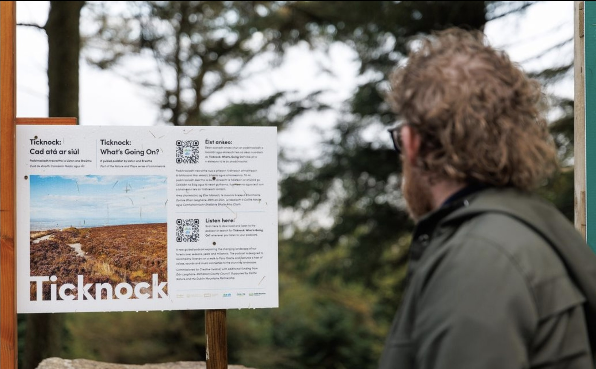

A poetic audio journey from [Ticknock Forest](//www.visitdublin.com/ticknock-fairy-castle-loop) car park to Fairy Castle, guided by the voices of caretakers and communities who deeply value these natural spaces.

<ImageGrid props={props.data.mdx.frontmatter.embeddedImagesLocal} />{' '}

## Powered by [Audio Broadcaster](/audio-broadcaster)

Listening to a podcast on a hike can be challenging without a Spotify subscription or the right app. To make this project accessible and user-friendly, we designed a simple web page accessible via a QR code at the car park.

Since the signal can be unreliable along this trail, we created a web page that **works offline**:
* Load the page once, and all audio content is downloaded.
* You can close the page and reopen it anytime during the hike.
* When reopening or refreshing the page, it functions like a normal website — but **without requiring a network connection**.

## Team

**Created by:** Listen & Breathe  
**Original Composition:** Kevin McNamara  
**Software Development:** Maxime Touroute & Rémy Dupanloup, [Audio Broadcaster](/audio-broadcaster)  
**Interviewees:** Rob Goodbody, Karen Woods, Ian Bromley, Clodagh Duffy, Lori Johnston, Niall Davis, Jo Denyer, Frank Prendergast, Roslyn and Robert Nicholson, Deirdre Black.  

Commissioned by Creative Ireland as part of the Nature and Place Commissions, with additional funding from Dún Laoghaire-Rathdown County Council. Supported by Coillte Nature and the Dublin Mountains Partnership.
