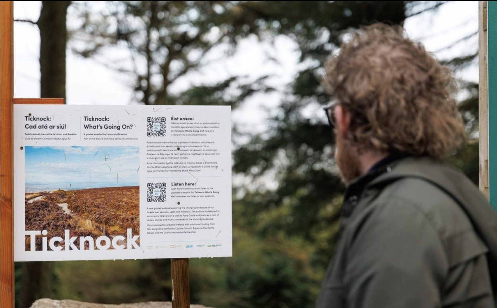

Un parcours audio poétique du parking de [Ticknock Forest](//www.visitdublin.com/ticknock-fairy-castle-loop) jusqu’au Fairy Castle, guidé par les voix des gardiens et des communautés qui chérissent ces espaces naturels.

<ImageGrid props={props.data.mdx.frontmatter.embeddedImagesLocal} />{' '}

## Propulsé par [Audio Broadcaster](/audio-broadcaster)

Écouter un podcast pendant une randonnée peut être compliqué sans abonnement à Spotify ou l’application adéquate. Pour rendre ce projet accessible et facile à utiliser pour tous, nous avons conçu une simple page web accessible via un QR code au parking.

Comme le signal est souvent instable le long du sentier, nous avons créé une page web qui **fonctionne hors ligne** :
* Chargez la page une fois, et tout le contenu audio est téléchargé.
* Vous pouvez fermer la page et la rouvrir à tout moment pendant la randonnée.
* En rouvrant ou actualisant la page, elle fonctionne comme un site web normal — mais **sans besoin de connexion réseau**.

## Équipe

**Créé par :** Listen & Breathe  
**Composition originale :** Kevin McNamara  
**Développement logiciel :** Maxime Touroute & Rémy Dupanloup, [Audio Broadcaster](/audio-broadcaster)  
**Interviewés :** Rob Goodbody, Karen Woods, Ian Bromley, Clodagh Duffy, Lori Johnston, Niall Davis, Jo Denyer, Frank Prendergast, Roslyn et Robert Nicholson, Deirdre Black.  

Commandé par Creative Ireland dans le cadre des Nature and Place Commissions, avec le soutien financier de Dún Laoghaire-Rathdown County Council. Avec le soutien de Coillte Nature et du Dublin Mountains Partnership.
