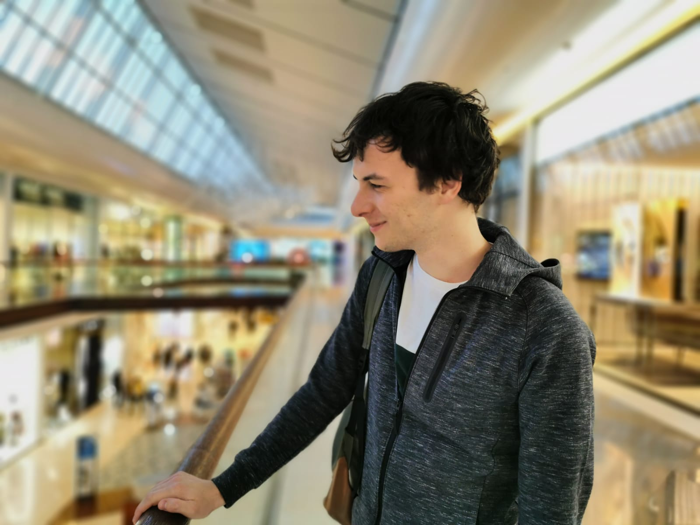

</img>

 
 

### — I'm Maxime, an engineer specialised in __audiovisual arts__

I've always been drawn by film making, photography and arts. I'm well versed in many skills around audiovisual creation, from shooting to post-production. I'm also a full fledged software engineer and using these skills to design new creative experiences. 
I love to work on audiovisual and art projects where my creativity and rigor can be an asset.
 
I'm always looking for new projects — if you would like to make something together, [get in touch !](/contact)

  

## — What I do

#### I make movies
I direct short movies, music clips, concert recordings... 
And I join movie crews as a camera operator or sound engineer during shooting, as a colorist or sound mixer during post.

#### I work on any kind of creative projects
Photography, video, museography, digital arts... If it's creative, I'm in for it !

#### And I code
Web apps, software, mobile apps... With my experience as a software engineer I design workflows to gain on productivity and I develop innovative solutions for art projects

 
 

# Overview of my work

#### My last short movies as a director
* **_"Veronika"_**, a short documentary about life's choices
* [Short movie "Innocent Words"](/innocentWords#content)
* [Music clip "Mari Pega"](/maripega#content)
* [Short movie "Réalité"](/realite#content)
* [Experimental Video "Rainy Day"](/rainyday#content)
* [Promotional clip "Astrakan Café"](/badhinjan-trio#content)
* [Short movie "Echos"](/echos#content)

#### My other creative projects
* [The Live Drawing Project](/livedrawing#content)
* [The Humanlape Project](/humanlapseProject#content)

 
 

# Work Experience

#### Freelance Software Engineer
_2016 - Today_  
_Part time missions_ 
* Working on the development of [Millumin](https://www.millumin.com/), a full-fledged solution for audiovisual shows and art installations
* Research and development in various fields : 3D (OpenGL, Metal, Unity), physics engine, computer vision

#### Camera Operator / Concert recording
_Spring 2018_
* Multicam recording of concerts and dance performance with an assistant
* for [Tous a la guil' Festival](http://sixiemecontinent.net/festival2018/tousalaguill.html)

#### Sound Engineer / Short movie
**_"Quand le loup n'y est pas"_** directed by Josephine Santraille  
_Spring 2018_
* Dialogue recording in harsh conditions: windy cliffs and in the middle of strong current rivers
* Sound design of heartbeats
* Sound mix with a tight schedule
* Supervision of a novice sound assistant

#### Colorist / Short movie
**_"Harmonie des sphères"_** directed by Vincent Montalieu  
_2018_
* Meticulous color grading to get the most of a low bitrate video source (Lumix GH2)
* [Project page for "Harmonie des sphères"](/harmoniedesspheres#content)

#### Colorist / Short movie
**_"Eva"_** directed by Julien Gasparoux  
_Spring 2018_
* recovery of noisy and under-exposed images
* complex color matching

#### Film Maker / Aftermovie
**_"Baraqu'en Prose Aftermovie_** for _Prose Events_
_February 2018_
* [Project page for "Prose Aftermovie"](/prose-aftermovie#content)

#### Sound Designer / Alarm Clock
_Winter 2017_
* 1' alarm clock music designed for a slow, calm but efficient awakening
* Available [here](https://soundcloud.com/max-io/am-clock-1)

#### Camera Operator / Concert recording
_Autumn 2017_
* Multicam & sound recording of a concert for the _Badhinjan Trio_

#### Assistant Director and Director of photography / Short film
**_"Harmonie des sphères"_** directed by Vincent Montalieu  
_Summer 2017_
* Director of photography, Camera operator, lighting and logistics
* [Project page for "Harmonie des sphères"](/harmoniedesspheres#content)

#### 2nd Sound assistant / Feature film
**_"Lune Rousse"_** directed by Cecile Briffoz, cinematography by Philippe Brelot  
_Summer 2017_
* laval mic placement, boom operator, ambient sound recordings
* back-ups, quality reports

#### Co-director, Post-production, Leading Role / Short film
**_"Ma Cousine"_** with Clementine Brochet  
_Spring 2017_
* Sound mix and color grading supervision

#### Assistant Director, Camera Operator, Post-production / Short film
**_"La Rue"_** with Clementine Brochet  
_Spring 2017_
* Visual effects to reduce the crew reflection on windows
* Heavy sound mix to recover sound from bad recordings

  

__Before 2017__

  

#### Director / IT Project progress videos
  * Videos following one of my academic project development through a year
  * First video : desktop animation showing project's concept
  * 2nd video : sequence shot showing project progress
  * 3rd video : promotional clip showing the project's vision
  * 4th video : animation showing the User Interface of a mobile app

#### Co-director / IT Project Showcase Video
* Video of an Augmented Reality golf game
* Interviews, game demo recording

#### Film Maker / Camera Sample Test Video
* 2" Video clip "Sunrise" available [here](https://www.youtube.com/watch?v=m29FKPodRjs)
* Shot with a Nikon D5500 DSLR

#### Co-director / Fake TV show Trailer
* Parodic trailer of the "True Detective" show
* Camera and sound operator
* Available [here](https://www.youtube.com/watch?v=cz8iNzDwNpc)

#### Director / Short film
* 2" short film "La Traque" for a student contest

#### Director / Short film
* 1" short film "Le Chant des Oiseaux" for the Mobile film festival

#### Director, Composer / Short film
* 2" video clip about a man having an Insomnia

#### Director, Leading Role / Short film
* 2" short film about hunting "La Chasse"

#### Co-director / Promotional clip
* Promotional clip against racism for "SOS Racisme" French organization

#### Composer / Short film
* Short film about cults "Le Dogme du bonheur"
* 1"30 ambiance sound composition

#### Director, Visual Effects / Short film
* 2" short film "Je suis ton inspiration"
* Visual effects to simulate a camera moving around a computer screen

#### Camera Operator / Culture Event
* Conférence, musical performances and projections
* Nantes, France

#### Film maker / Retirement party
* 5" video clip of the party and farewell messages
* Made for the engineering school In'Tech Info, Paris, France

#### Director / Short film
* 2" short film "Je suis Paramnésique"

#### Director / Short film
* 2" short film "Initiation"

#### Camera/Sound Operator / Short film
* 20" short film "Vigilantes"
