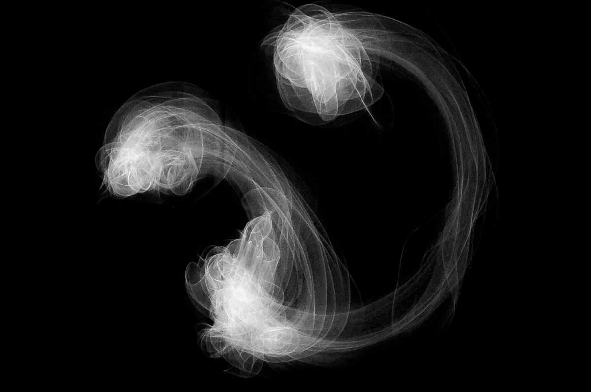
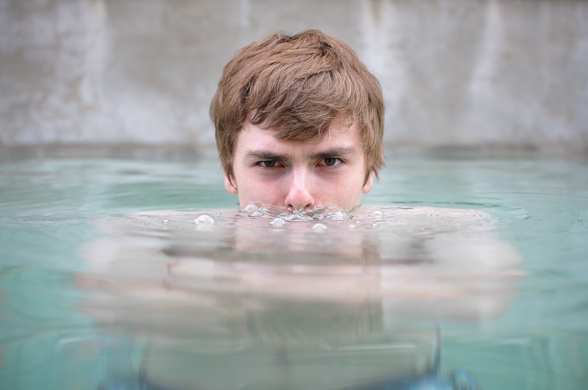
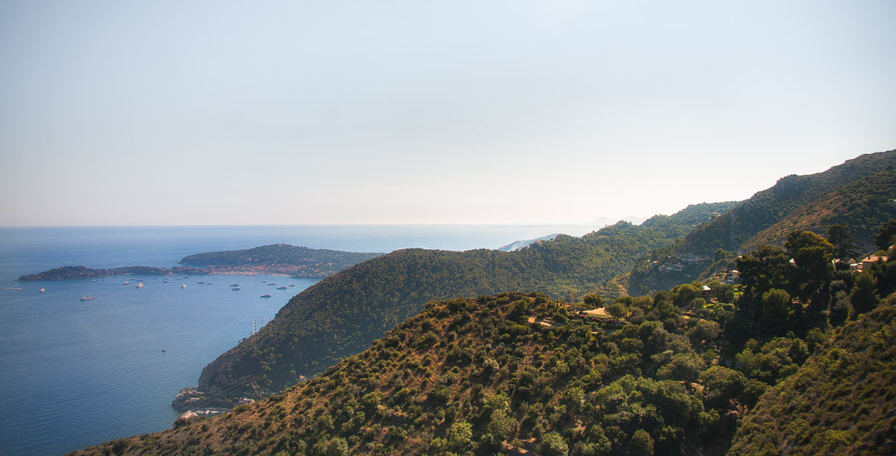
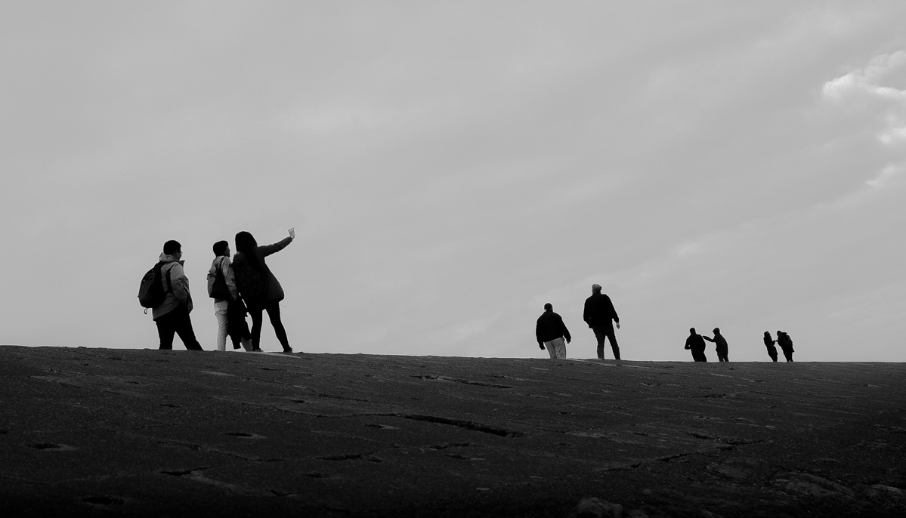
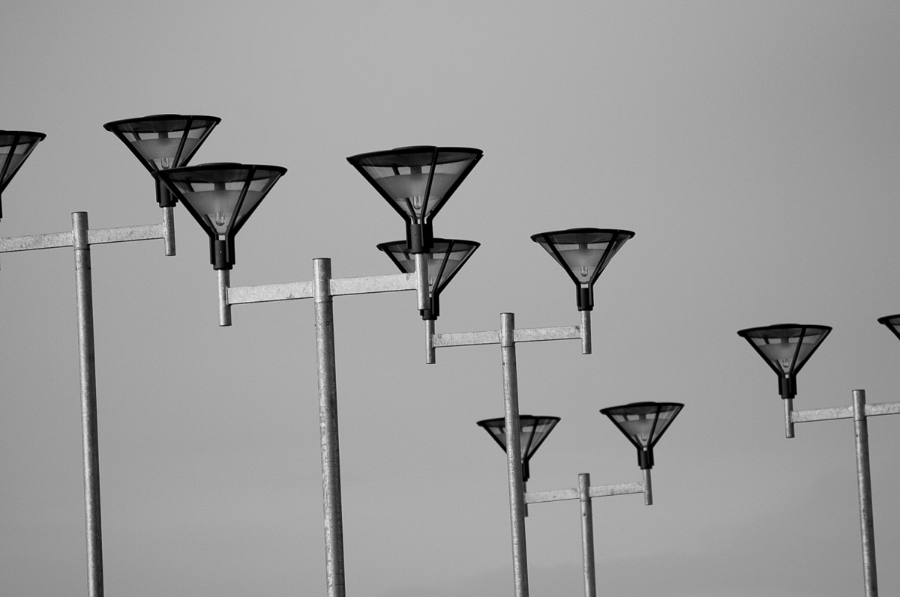
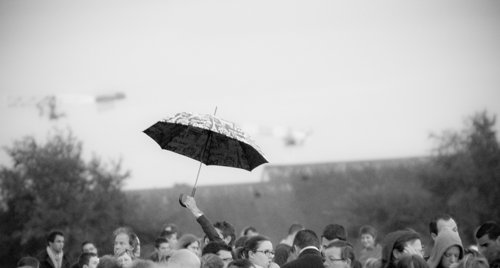
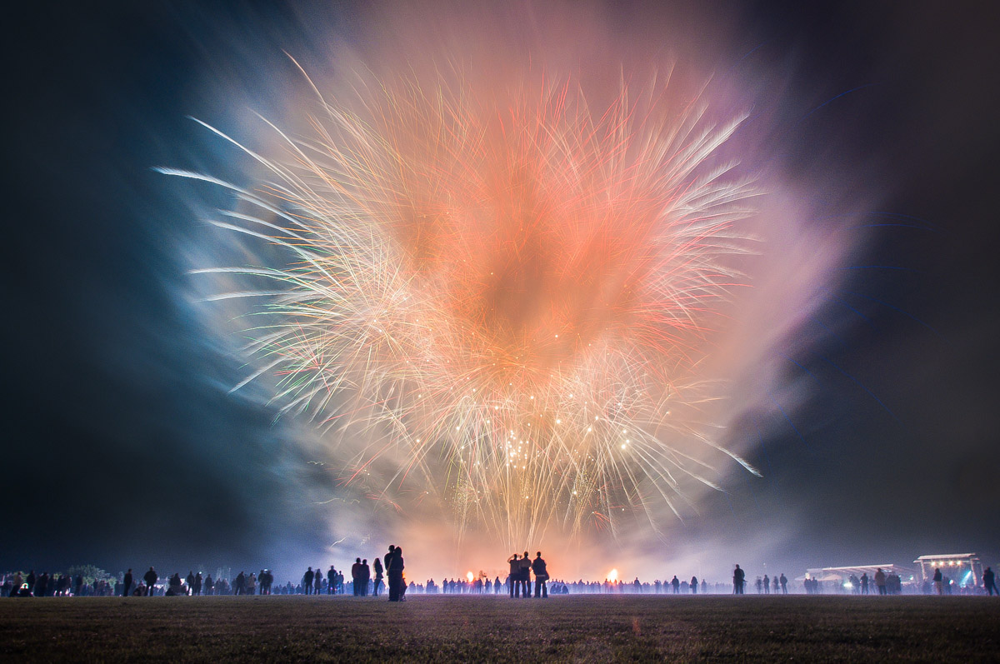

A selection of my photography works.

# Experiments

A series of experiments on the usage of lighting and photography techniques
 

<photo-grid>

</photo-grid>

# Portraits

<photo-grid>

</photo-grid>

# Landscapes

<photo-grid>

</photo-grid>

# Architecture

 

<photo-grid>

</photo-grid>

# Dailies

A collection of shots from the everyday ramblings of my life.
 

<photo-grid>

</photo-grid>

Want more ? Check out my [Instagram](https://instagram.com/maximetouroute)
